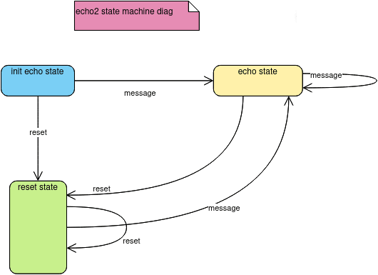

# echo2 : Soroban Rust SDK piece of code

[GitHub url](https://github.com/huitemagico/echo2)

  README.md Version 21-09-2023
  Note: If you want to access a comprehensive documentation for installing all the necessary tools to run 'echo2,' 
  please refer to [echo2tutorial.pdf] (https://github.com/huitemagico/echo2/blob/rama1/echo2tutorial.pdf)  on this same site.
  
##  (1) name 
  echo2 "tiny piece of code for learning and practice soroban rust sdk"
  version 1.1 
  

##  (2) What is the function of the echo2 program
This program takes a text parameter as input from the caller, retrieves the previous message from 
persistent storage associated with the contract, and then saves the new message. 
So, with each subsequent call, 'echo2' returns 'the echo of your message' along with the previous message.

## (3) Echo2 as an finite state machine
Echo2 is a program that implements a basic state machine with two states: reset_state and echo_state. 
In the reset_state, the program does not process the previous message but instead resets it with a special meaning. 
If Echo2 receives another reset message while in the reset_state, it remains in that state. 
However, if it receives a message different from "reset," it transitions to the echo_state while saving the previous state and counter.
While in the echo_state, if Echo2 receives a general message that is different from "reset," it remains in that state. 
The machine continues to stay in the echo_state until it receives a "reset" message, at which point it transitions back to the reset_state.
The following diagram describes this
.

Note: The explanation of a state machine is easiest using a "finite state machine diagram" for better understanding.
See "[finite state machine diagram](https://en.wikipedia.org/wiki/Finite-state_machine)" 

## (4) Example run	
Note: If you want to access a comprehensive documentation for installing all the necessary tools to run 'echo2,' please refer to 'echo2tutorial.pdf' on this same site.
	 Example:
	 Note: It's useful that, before anything else, you call the program with the 'reset' parameter.
	 
	 soroban contract invoke \
    --wasm target/wasm32-unknown-unknown/release-with-logs/echo2.wasm \
    --id 1 \
    -- \
    echo2\
    --message reset
	
	
	Response return of echo2 is:
	
	 [5,186,["echo2 v.1.1 27/08/2023","ResetMessageStored","reset"]
	 
	 Element(1): 5  : This is the length of the message received
	 Element(2): 186 : This is the counter of executions
	 Element(3): "echo2 v.1.1 27/08/2023"   : This is the version of the echo2 program
	 Element(4):  "ResetMessageStored"     : Message saying that the stored message has been resetting
	 Element(5):  The message that has been received by echo2
	 	   
	run number 2:	   
	soroban contract invoke \
    --wasm target/wasm32-unknown-unknown/release-with-logs/echo2.wasm \
    --id 1 \
    -- \
    echo2\
    --message "On the last day of the world, I would want to plant a tree."
	
	 echo2 return :
	 
	 [59,187,["echo2 v.1.1 27/08/2023","reset","On the last day of the world, I would want to plant a tree."]]
	 
	 In this moment, the "old message" was "reset".

 ##	 (5) Topics used at program, and urls
 | Topic    | url |
| -------- | ------- |
|  storage   | https://docs.rs/soroban-sdk/latest/soroban_sdk/storage/index.html  |
|   Persisting Data         | https://soroban.stellar.org/docs/fundamentals-and-concepts/persisting-data  |
| struct String     |https://docs.rs/soroban-sdk/latest/soroban_sdk/struct.String.html |
|Soroban struct Vec  | https://docs.rs/soroban-sdk/latest/soroban_sdk/struct.Vec.html|
|struct Env  | https://docs.rs/soroban-sdk/latest/soroban_sdk/struct.Env.html  |
|Soroban CLI  | https://soroban.stellar.org/docs/getting-started/setup#install-the-soroban-cli  |
|Soroban examples doc    | https://soroban.stellar.org/docs/basic-tutorials/events |
|Soroban examples     | https://github.com/stellar/soroban-examples) |
|rust doc     | https://doc.rust-lang.org/std/index.html|
|Soroban Rust sdk     | https://soroban.stellar.org/docs/reference/sdks/rust|
|Github url |[GitHub url](https://github.com/huitemagico/echo2)|

 ##	(6)	Steps for run the program:
 Note: If you want to access a comprehensive documentation for installing all the necessary tools to run 'echo2,' please refer to 'echo2tutorial.pdf' on this same site."
	If you want to test and experiment with the code steps are the following:
	
	Step a. download the code from github page
	Step b. check the structure for echo2, is the standard.
	 i.e. at the main directory you must run the compile, build code, and the src files (lib.rs, test.rs) 
	 are under src directory.
    Step c. at main directory run the code for compile and test.
	 cargo test -- --nocapture
     note: because of changing answers of code, testing begin with resetting the stored message.
    Step d. run build code
	 soroban contract build --profile release-with-logs
	 note: if you want no logs you have to change parameters above.
    Step e. run code
	 You could copy the code above, or if you like poetry, use the examples below. :-)
	 

## (7) Some comments about my experience with programming this code.
I am a 'little baby' in this software and environment. :-D
I started my interest in Soroban and Rust almost three weeks ago, so in these topics, I am VERY new. :-D

I can say that there is good documentation available for the Soroban SDK (https://soroban.stellar.org/docs/fundamentals-and-concepts/high-level-overview). 
However, in my opinion (given my level of expertise), there is a significant opportunity for providing more basic examples. 
I believe that having more small examples would make it easier to use the SDK.

Nevertheless, for me, starting the journey with the Rust language AND the Soroban SDK has been both enjoyable and challenging. 
I began by installing Ubuntu 23 on my computer three weeks ago, and after that, I delved into the documentation, 
starting with understanding Stellar's business and ending with working with the Soroban SDK. 
It was quite a challenging experience.

After these weeks, the list of URLs provided above represents a roadmap for continuing this journey.

I hope that this piece of code and the URLs can make it easier for people who are just starting to learn.
Note: If you want to access a comprehensive documentation for installing all the necessary tools to run 'echo2,' please refer to 'echo2tutorial.pdf' on this same site."

	 
##	 (8) about me.
About me:
Currently, I am a very happy freelance programmer. 
I started with punched card programming using UR machines, then moved on to Assembler for IBM 360 in the seventies. 
My experience includes PL/1, Algol, Fortran, COBOL, and C.
After working as a programmer in the early years, I spent many (perhaps too many!) years as a Business Analyst. 
In recent years, I had the opportunity to work extensively on a Java Spring Batch project.
And now, of course, I have become a Soroban fan :-D because I believe that Smart Contracts represent a new and significant revolution.
	 
##	 (9) GitHub url
https://github.com/huitemagico/echo2

