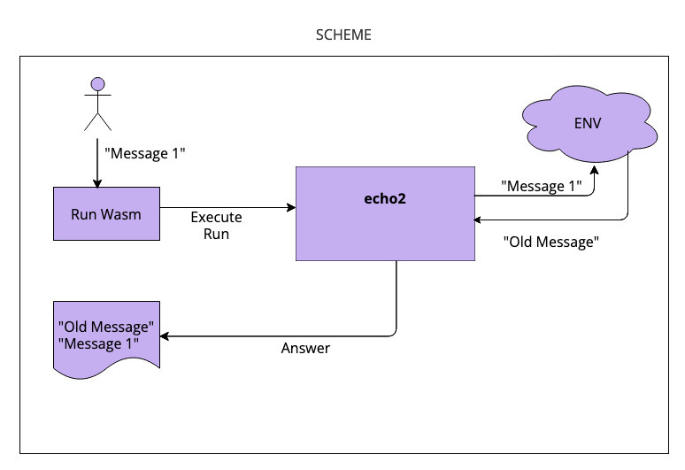
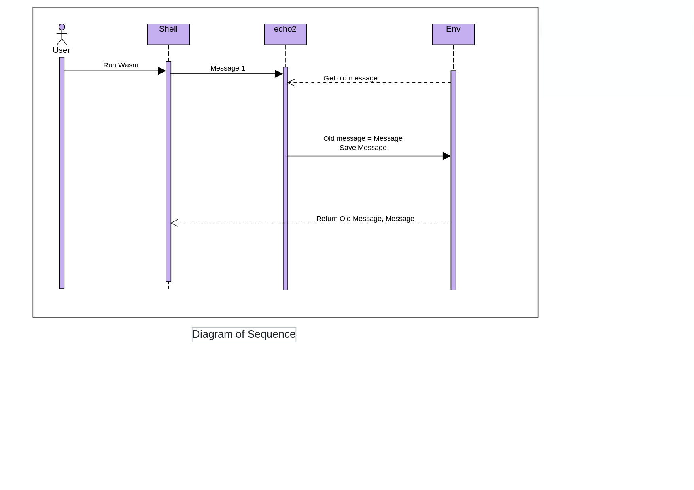

# echo2 Soroban Rust SDK piece of code

  README.md 
 ##(1) name 
  echo2 "tiny piece of code for learning and practice soroban rust sdk"
  version 1.0  
  
 ##  (2) function description
	 
    This code example receive an text parameter from caller, saving this text on storage,
	and return the text and the former text received.
	
	 Example:
	 For very first time, echo2 accept resetting his storage.
	 See invoke below:
	 soroban contract invoke \
    --wasm target/wasm32-unknown-unknown/release-with-logs/echo2.wasm \
    --id 1 \
    -- \
    echo2\
    --message reset
	
	
	Response return of echo2 is:
	
	 [5,186,["echo2 v.1.1 27/08/2023","ResetMessageStored","reset"]
	 
	 Element(1): 5  : This is the length of the message received
	 Element(2): 186 : This is the counter of executions
	 Element(3): "echo2 v.1.1 27/08/2023"   : This is the version of the echo2 program
	 Element(4):  "ResetMessageStored"     : Message saying that the stored message has been resetting
	 Element(5):  The message has been received by echo2
	 	   
	run number 2:	   
	soroban contract invoke \
    --wasm target/wasm32-unknown-unknown/release-with-logs/echo2.wasm \
    --id 1 \
    -- \
    echo2\
    --message "On the last day of the world, I would want to plant a tree."
	
	 echo2 return :
	 
	 [59,187,["echo2 v.1.1 27/08/2023","reset","On the last day of the world, I would want to plant a tree."]]
	 
	 In this moment, the "old message" was "reset".
	 
		   

	
 ##	 (3) Inspiration and some tech details
	 Loosely based  from examples/events 
	 Use Persistent kind of storage instead of Instance.
	 Use of t-uplas for input and output
	 
 ##	 (4) Topics I have learned and links for review:
	 
	 a. storage . See https:docs.rs/soroban-sdk/latest/soroban_sdk/storage/index.html
	  note: persistent storage is not recomended for production environment! 
	   see https:soroban.stellar.org/docs/fundamentals-and-concepts/persisting-data
	 b. String manipulation. Obs.: rust String is different from soroban struct String . 
	                                                                https:docs.rs/soroban-sdk/latest/soroban_sdk/struct.String.html
	 c. struct Vec from soroban .                  https:docs.rs/soroban-sdk/latest/soroban_sdk/struct.Vec.html
	 d. struct Env from Soroban sdk .           https:docs.rs/soroban-sdk/latest/soroban_sdk/struct.Env.html
	 e. doc from Soroban                              https:soroban.stellar.org/docs/getting-started/setup#install-the-soroban-cli
	 f. doc for (some) examples                   https:soroban.stellar.org/docs/basic-tutorials/events
	 g. the examples                                    https:github.com/stellar/soroban-examples
	 h. rust doc sometimes gives you hope... BUT  helas!... we must use #![no_std] !!  https:doc.rust-lang.org/std/index.html
	 i. main page for soroban Rust sdk       https:soroban.stellar.org/docs/reference/sdks/rust
	 j. some shell utils to easy operation    please see main page of github for echo2 
	 l. ubuntu Rust installation                  https:linuxhint.com/rust-programming-language-ubuntu-2204/
	 
 ##	(5)	Steps for run the program:
	If you want to test and experiment with the code steps are the following:
	
	Step a. download the code from github page
	
	Step b. check the structure for echo2, is the standard.
	 i.e. at the main directory you must run the compile, build code, and the src files (lib.rs, test.rs) 
	 are under src directory.
	 
	 Step c. at main directory run the code for compile and test.
	 cargo test -- --nocapture

     note: because of changing answers of code, testing begin with resetting the stored message.
	 
	 Step d. run build code
	 soroban contract build --profile release-with-logs
	 note: if you want no logs you have to change parameters above.
	 	 
	 Step e. run code
	 You could copy the code above, or if you like poetry, use the examples below. :-)
	 

##	 (6) Some comments about my experience on programming this code.
	 Iam a "little baby" on this software and environment. :-D
	 I began my interest on Soroban and Rust almost three weeks ago, so on these themes I am VERY young :-D
	 
	 I could say that about Soroban SDK, is that there is good documentation about SDK (https://soroban.stellar.org/docs/fundamentals-and-concepts/high-level-overview)
	 But in my opinion (and level of expertise), I think that there is a big opportunity, for writing more basic examples.
	 I think that there is a lack of little examples for making more easy use the SDK.
	 
	 Nevertheless for me, beginning the journey of Rust language PLUS the Soroban SDK has been a lovely and hard work.
	 I began with the installation of UBUNTU 23 in my computer three weeks ago and after that, I began to read the documentation, beginning for 
	 understanding the business of Stellar, and ending for working with the Soroban SDK . It was a very hard work.
	 
	 After these weeks, the list of urls listed above represent a map for continuing the travel.
	 
	 I hope that this piece of code and urls, could serve for making easier the task people who begin this learming.
	 
##	 (9) about me.
	 About me.
Nowadays I am a very happy freelance programmer.
I began with punched cards programming with UR machines, then Assembler IBM 360 in the seventys.
My experience include PL/1, Algol, Fortran, COBOL, C.
After working as programmer in the beginning, I was Business Analyst for a lot (too much!)of years.
Last years I had the opportunity for working hard on Java Spring Batch project.
And now obviously I am converted to Soroban fan :-D , because I think that Smart Contract is a new big revolution.
	 
##	 (10) some interesting messages for try:
	 soroban contract invoke \
    --wasm target/wasm32-unknown-unknown/release-with-logs/echo2.wasm \
    --id 1 \
    -- \
    echo2\
    --message "On the last day of the world, I would want to plant a tree."

soroban contract invoke \
    --wasm target/wasm32-unknown-unknown/release-with-logs/echo2.wasm \
    --id 1 \
    -- \
    echo2\
    --message "Tell me what you see vanishing and I will tell you who you are."

soroban contract invoke \
    --wasm target/wasm32-unknown-unknown/release-with-logs/echo2.wasm \
    --id 1 \
    -- \
    echo2\
    --message "Poetry is a way of looking at the world for the first time."

soroban contract invoke \
    --wasm target/wasm32-unknown-unknown/release-with-logs/echo2.wasm \
    --id 1 \
    -- \
    echo2\
    --message "Now all my teachers are dead except silence."

soroban contract invoke \
    --wasm target/wasm32-unknown-unknown/release-with-logs/echo2.wasm \
    --id 1 \
    -- \
    echo2\
    --message "William S. Merwin"
	
## GitHub url
https://github.com/huitemagico/echo2

